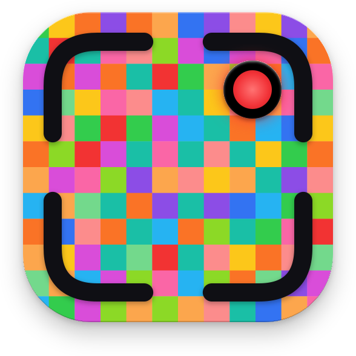

<div align="center">



# LiveBlock

On-device, neural ad blocker for your screen. Captures display frames in
real time, detects advertisements with a local CoreML model, and replaces
them with content-aware fill before they reach your eyes. No frames leave
the machine.

[]()
[]()
[]()
[]()

</div>

---

## Why

Browser ad-blockers stop at the page. LiveBlock works at the display
layer, so it covers in-app ads, streaming overlays, and sponsored sections
of feeds — wherever pixels are drawn.

## Features

- Screen-level blocking. Operates on every app, not just browsers.
- On-device inference. CoreML on macOS, DirectML / ONNX Runtime on Windows
  and Linux. Frames stay local.
- Native macOS 26 chrome. SwiftUI Liquid Glass — `.glassEffect`,
  `.glassProminent` buttons, system Toggle.
- Manual region editor. Draw, drag, resize, delete. Persisted across launches.
- In-app training loop. Capture, label, train, ship a personal model
  without leaving the app.
- Mirror-blend inpainter. Content-aware fill computed from the region's
  surrounding pixels. No model weights, runs at frame rate.
- Cross-platform. macOS native; Rust + Tauri ports for Windows and Linux
  share data types and IPC vocabulary via the `core/` crates.

## Quick start

### macOS

```bash
brew install xcodegen fswatch          # fswatch is optional, only for ./run.sh --watch
git clone <this-repo>
cd LiveBlock
tools/setup_codesign_identity.sh       # one-time: stable signing for TCC
./run.sh                               # build + launch
./run.sh --install                     # install to /Applications
./run.sh --watch                       # rebuild + relaunch on every save
./run.sh --reset-perms                 # print TCC reset commands when permissions get stuck
```

`run.sh` regenerates the Xcode project, builds the Rust bridge, signs the
app with a stable identity (so Screen Recording / Accessibility grants
persist across rebuilds), and launches. First run prompts for Screen
Recording (required) and Accessibility (for global hotkeys).

Use `./kill.sh` to force-quit if anything gets stuck.

Requires macOS 26 (Tahoe). Older releases are not supported.

#### First-run checklist

1. `tools/setup_codesign_identity.sh` (once) — stable codesigning identity so TCC
   keeps your permission grants across rebuilds.
2. `./run.sh` — first launch shows two macOS prompts:
   - **Screen Recording** — required for capture. Click "Open System Settings",
     enable LiveBlock, then return to the app.
   - **Accessibility** — required for global hotkeys (⌘⇧L, ⌘⇧B, ⌘⇧S).
3. Click **Start** in the Control Panel (or ⌘⇧L).
4. Press **⌘⇧B** to open the Region Editor. The render layer hides automatically
   while the editor is open — drag a rectangle around something you want
   blocked. Press **Esc** when done.
5. Capture is now blocking that region with the selected fill style. The
   bundled detector is an experimental three-concept YOLO-World export for
   logos, ad banners, and sponsored content. It generalizes beyond fixed brand
   classes, but it is not a guarantee that every ad will be found; use manual
   regions and the labeling/training loop for misses.

#### When permissions get stuck

macOS TCC sometimes drops grants if the app's code-signing hash changes
(e.g. you ran `./run.sh` once before `setup_codesign_identity.sh`, then
again after) or if you have a stale `/Applications/LiveBlock.app` from an
earlier build with a different signature. Symptoms: the toggle in System
Settings → Privacy → Screen Recording is grey, or the prompts re-appear
on every launch.

```bash
./run.sh --reset-perms       # prints the exact tccutil commands to copy
```

Then run the printed commands and `./run.sh` again. Grants will stick from
that point onward as long as `tools/.codesign_identity` exists.

#### When changes don't take effect

`run.sh` always kills the running instance, regenerates the project, and
launches the freshly-built binary from DerivedData. If a change still
seems missing, you're probably looking at the wrong copy of the app:

- A stale `/Applications/LiveBlock.app` (from a previous `--install`). The
  Dock and Spotlight launch this one, not the DerivedData binary. `run.sh`
  warns when its hash diverges from the fresh build — re-run with
  `--install` or `rm -rf /Applications/LiveBlock.app`.
- A `LiveBlock 2.xcodeproj` Finder duplicate. `run.sh` refuses to build
  while one exists; `rm -rf "LiveBlock 2.xcodeproj"` to clean up.

### Windows

```pwsh
cd platform\windows
npm install
cargo tauri dev
```

Prerequisites: Rust, MSVC build tools, Node 20+, `cargo install tauri-cli`.
See [`platform/windows/README.md`](platform/windows/README.md).

### Linux

```bash
cd platform/linux
bash scripts/setup-ubuntu.sh   # or setup-fedora.sh / setup-arch.sh
npm install
cargo tauri dev
```

See [`platform/linux/README.md`](platform/linux/README.md).

## Hotkeys

| Combo                     | Action                                |
|---------------------------|---------------------------------------|
| ⌘⇧L                       | Toggle capture                        |
| ⌘⇧B                       | Toggle Region Editor                  |
| ⌘⇧S                       | Capture screenshot for labeling       |
| ⌘⇧⌥ .                     | Panic disable                         |
| Esc                       | Exit Region Editor                    |
| ⌘Q                        | Quit                                  |

Windows and Linux mirror the same shortcuts with `Ctrl` instead of `⌘`.

## How it works

```
┌────────────────────────────────────────────────────────────┐
│        Capture (60 Hz)                                     │
│  macOS: ScreenCaptureKit · Win: WGC · Linux: PipeWire/X11  │
└──────────────────────────┬─────────────────────────────────┘
                           │
            ┌──────────────┼──────────────┐
            ▼              ▼              ▼
   Detection (15 Hz)  Region Store   Inpainting (60 Hz)
   YOLOv8 → mask cache    │           Mirror-blend, content-aware
            └──────────────┼──────────────┘
                           ▼
              Render Layer · click-through overlay
```

- Capture pulls display frames into a CV pixel buffer / D3D11 texture / DMA-BUF.
- Detection runs on every Nth frame on the GPU/ANE; results are cached.
- Region store holds user-drawn rectangles in normalized [0..1] coords —
  portable across resolutions and platforms.
- Inpainting picks an axis from the region's aspect ratio, samples a band
  of pixels above and below (or left and right), reflects each band across
  the region's adjacent edge, and cross-fades the two with a linear
  gradient. No model weights, runs at frame rate.
- Render layer is a click-through overlay that paints only the inpainted
  patches.

## Train your own detector

The bundled open-vocabulary model targets logos, ad banners, and sponsored
content without a fixed brand list. Detection quality still varies by layout,
size, and contrast. To personalize it for the ads you actually see:

1. Click Start, grant Screen Recording on first run.
2. While browsing normally, press ⌘⇧S each time you see an ad.
3. Open the Label window and drag a rectangle around each ad. Yellow
   proposals from the bundled model help — accept or reject with one click.
4. Open the Training Dashboard, click Train Now.
5. A macOS notification fires when training completes; the new model is
   auto-installed.

End-to-end docs in [`tools/README.md`](tools/README.md). Realistic timing
on M-series Macs: 30 minutes to 3 hours, depending on dataset size.

## Repository layout

```
LiveBlock/
├── Sources/                macOS app (Swift + AppKit + SwiftUI + ScreenCaptureKit)
├── Tests/                  XCTest target
├── core/                   Cross-platform Rust crates (regions, labels, detection, bridge)
├── platform/
│   ├── windows/            Windows port (Rust + Tauri 2 + windows-rs + DirectML)
│   ├── linux/              Linux port (Rust + Tauri 2 + ashpd + x11rb + wgpu)
│   └── _shared-frontend/   HTML + TS for the Tauri ports
├── tools/                  Python training pipeline + setup scripts
├── models/                 YOLO weights (.pt) + brand assets
├── ARCHITECTURE.md         Cross-platform architecture
└── ASSESSMENT.md           Standing audit + roadmap
```

## Project status

| Component            | Status                                                |
|----------------------|-------------------------------------------------------|
| macOS app            | Capture, region editor, labeling, training dashboard, ML detector tuning. Native macOS 26 Liquid Glass UI. Linked against the Rust core via swift-bridge. |
| Rust core            | Five crates (regions, labels, detection, bridge, core). 33 unit tests. JSON byte-compatible across all platforms. |
| Windows port         | Experimental scaffold. WGC/DirectML code exists, but the locked dependency graph and callback integration are not yet release-verified. |
| Linux port           | Experimental scaffold. Capture, global hotkeys, and click-through overlays still contain platform TODOs and are not functional end to end. |
| Bundled detector     | Experimental YOLO-World model for Logo / Ad banner / Sponsored; fixture-based precision/recall validation is still required. |
| Code signing         | Stable self-signed identity via `tools/setup_codesign_identity.sh`. Developer ID + notarization is a separate task. |

## Roadmap

- Build and gate a representative detector evaluation corpus with per-class precision/recall targets.
- LaMa generative inpainting via Metal Performance Shaders for textured backgrounds.
- Wrap the Windows/Linux pipelines in the shared `Capture` / `Detector` /
  `Inpainter` traits from `liveblock-core`.
- Linux GPU inpainter (wgpu/Vulkan compute pipeline).
- Sparkle auto-update + Developer ID signing + notarization.

## Documentation

- [`ARCHITECTURE.md`](ARCHITECTURE.md) — system design and migration phases.
- [`ASSESSMENT.md`](ASSESSMENT.md) — standing audit and prioritized roadmap.
- [`AI.md`](AI.md) — guide for AI agents working on this codebase.
- [`tools/README.md`](tools/README.md) — training-pipeline walkthrough.
- [`platform/windows/README.md`](platform/windows/README.md) — Windows build prerequisites.
- [`platform/linux/README.md`](platform/linux/README.md) — distro-specific setup.

## Contributing

Issues and pull requests welcome. Two house rules:

1. No frames leave the user's machine. Local-only is the product.
2. Do not claim something works until it has been verified. Build green
   plus tests green is not enough — UI/UX changes need an actual run.


---

Made with [Claude](https://claude.ai).
